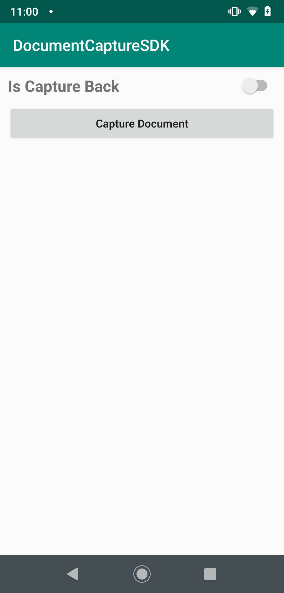
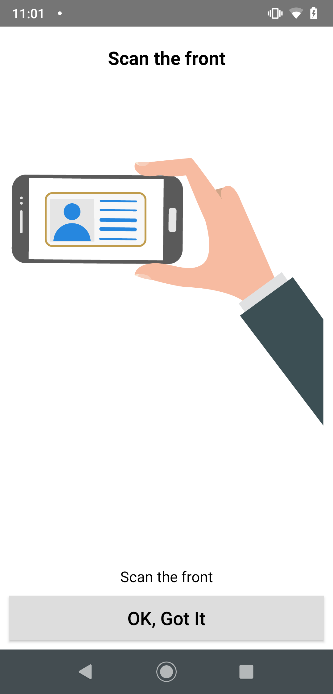
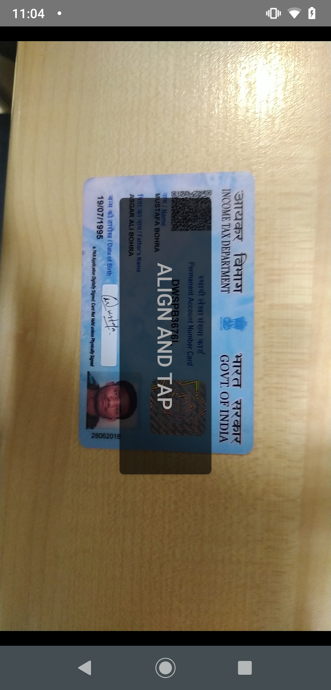
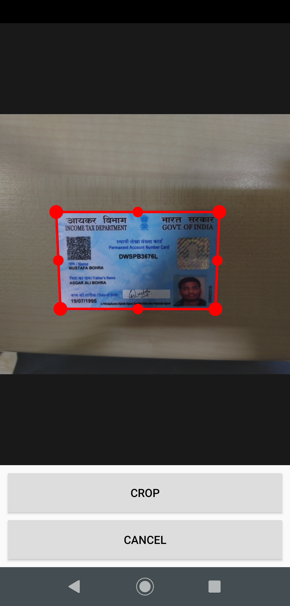
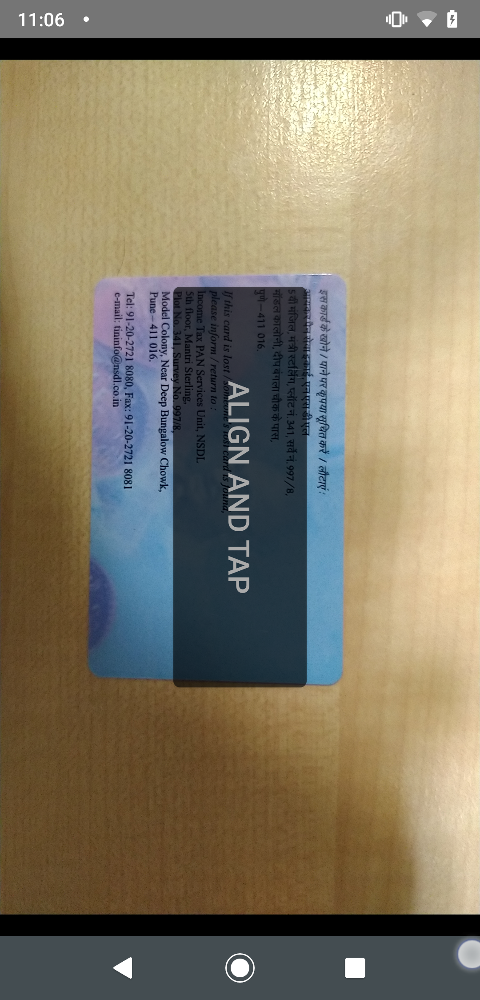
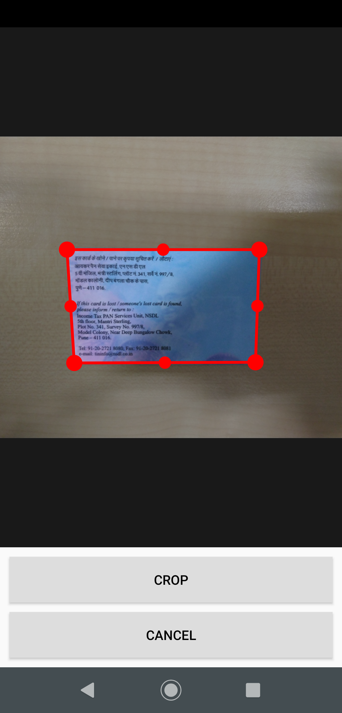
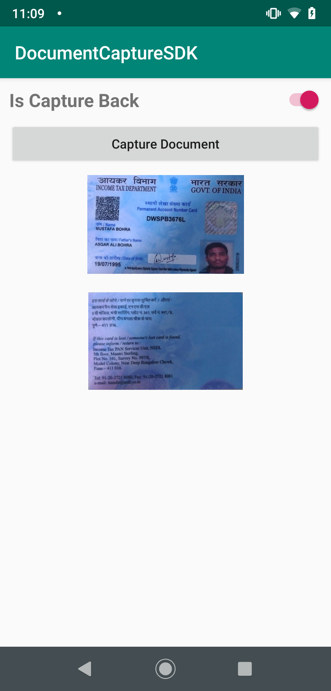

## Document Scanner SDK


### This SDK based on OpenCV which is been created to scan, capture and crop the document.

- Capture Document from Front and Back
- Crop with Auto-Edge-Detection

Sole purpose of this SDK is to capture the snapshot of document via scan mode, even you get the functionality of auto-edge-detection, so that you can crop the images more accurately.

#### You can achieve the functionality with easy integration of following steps:
- In your project level build.gradle add this dependency:
```sh 
allprojects {
   repositories {
      jcenter()
       maven {
            url "https://dl.bintray.com/vikashkumar/documentscanner" 
       }
    }
 } 
```
- In your app level build.gradle add this dependency:
```sh
implementation 'documentscanner:documentscanner:1.0.1'
```
- Now in your project's activity create DocumentCaptureInstance object: 
```sh
private lateinit var documentCaptureInstance: DocumentCaptureInstance
```
- Initialize this object with your sdkToken 
```sh
documentCaptureInstance = DocumentCaptureInstance(this, "YOUR_SDK_TOKEN")
```

#### You can customize the color and theme of the SDK's view according to your projects user-experience.
#### Just access the properties mentioned in the SDK. Have a look at the sample below:

```sh
val config = DocumentCaptureConfig()
config.isDocumentBackCaptureRequired = true
config.cameraScreenBackgroundColor =
       ContextCompat.getColor(this, R.color.black)
config.tutorialScreenBackgroundColor =
       ContextCompat.getColor(this, R.color.colorPrimaryDark)
config.cropScreenBackgroundColor =
       ContextCompat.getColor(this, R.color.black)
```

- Call captureDocument function from documentCaptureInstance
```sh
documentCaptureInstance.captureDocument(
       config,
       object : DocumentCaptureInstance.DocumentCaptureListener {
           override fun onDocumentCaptureSuccess(path: List<String>) {
               // get back and front image path from path:List<String>
           }
           override fun onDocumentCaptureFailure(error: DocumentCaptureInstance.DocumentCaptureError) {
               // document uploading failed, please check error
           }
       })
```

- Override onActivityResult:
```sh
override fun onActivityResult(requestCode: Int, resultCode: Int, data: Intent?) {
   super.onActivityResult(requestCode, resultCode, data)
   if (resultCode == Activity.RESULT_OK && requestCode == DfDCConstants.REQUEST_CODE_DOCUMENT_CAPTURE_INSTANCE) {
       if (::documentCaptureInstance.isInitialized) {
           documentCaptureInstance.onDocumentCaptureResult(requestCode, resultCode, data)
       }
   }
}
```


#### By calling ```captureDocument()``` method you will be redirected to the document capture flow which is shown in below sequence of images:
<br>
<p align="left">



 <br>
  
Repeat the same procedure to capture the back of document as well.
  
<p align="left">




